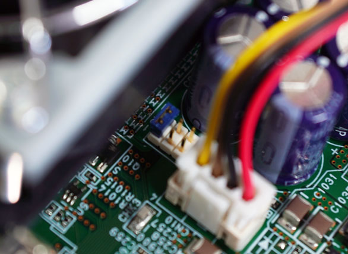

# Fan Control
  
AUTD3 devices have fans with three modes: Auto, Off, and On.

In Auto mode, the temperature monitoring IC monitors the temperature of the IC and automatically activates the fan when it exceeds a certain temperature.
In Off mode, the fan is always off, and in On mode, the fan is always on.

The mode can be switched using the jumper switch next to the fan. It is a bit difficult to understand, but as shown in the figure below, shorting the fan side sets it to Auto, the middle to Off, and the right side to On.

<figure>
    
    <figcaption>Jumper switch for AUTD fan control</figcaption>
</figure>

In Auto mode, the fan automatically activates when the temperature rises.

In Auto mode, the fan can be forcibly activated with `ForceFan`.

<div class="tabs">
<input id="rust_tab" type="radio" class="tab" name="tab" checked>
<label class="tab_item" n=4 for="rust_tab">Rust</label>
<input id="cpp_tab" type="radio" class="tab" name="tab">
<label class="tab_item" n=4 for="cpp_tab">C++</label>
<input id="cs_tab" type="radio" class="tab" name="tab">
<label class="tab_item" n=4 for="cs_tab">C#</label>
<input id="python_tab" type="radio" class="tab" name="tab">
<label class="tab_item" n=4 for="python_tab">Python</label>

```rust,edition2024
{{#include ../../../codes/Users_Manual/fan.rs}}
```

```cpp
{{#include ../../../codes/Users_Manual/fan.cpp}}
```

```cs
{{#include ../../../codes/Users_Manual/fan.cs}}
```

```python
{{#include ../../../codes/Users_Manual/fan.py}}
```
</div>

The argument of the `ForceFan` constructor is `Fn(&Device) -> bool`, which specifies whether to forcibly drive the fan for each device.

> NOTE: You cannot forcibly turn off the fan in Auto mode.
