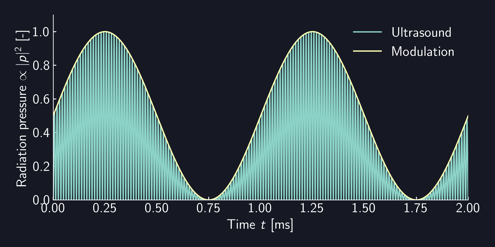

# RadiationPressure

`RadiationPressure` is a `Modulation` that applies modulation to radiation pressure (proportional to the square of sound pressure) instead of sound pressure.

For example, when `RadiationPressure` is applied to a $\SI{1}{kHz}$ `Sine` modulation, the radiation pressure of the sound pressure amplitude will be as follows, and the envelope of the radiation pressure will follow a $\SI{1}{kHz}$ sine wave.

<figure>
  
</figure>

{{ #tabs }}
{{ #tab name=Rust }}
```rust
{{#include ../../../../codes/Users_Manual/modulation/radiation_0.rs}}
```
{{ #endtab }}
{{ #tab name=C++ }}
```cpp
{{#include ../../../../codes/Users_Manual/modulation/radiation_0.cpp}}
```
{{ #endtab }}
{{ #tab name=C# }}
```cs
{{#include ../../../../codes/Users_Manual/modulation/radiation_0.cs}}
```
{{ #endtab }}
{{ #tab name=Python }}
```python
{{#include ../../../../codes/Users_Manual/modulation/radiation_0.py}}
```
{{ #endtab }}
{{ #endtabs }}
