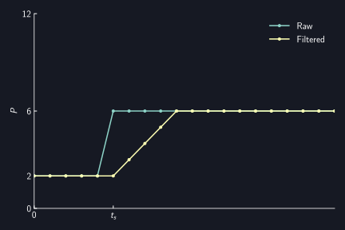
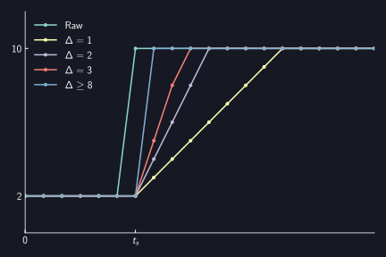

# Silencer

AUTD3 provides a Silencer to reduce noise of the output.
The Silencer suppresses sudden changes in the drive signal of the transducers, making it quieter.

[[_TOC_]]

## Theory

For details, refer to the paper by Suzuki et al.[^suzuki2020].

In summary,

* Amplitude-modulated ultrasound generates audible sound.
* When driving ultrasonic transducers, phase changes cause amplitude fluctuations.
    * Therefore, audible noise is generated.
* By linearly interpolating phase changes and gradually changing them, amplitude fluctuations can be suppressed.
    * Therefore, noise can be reduced.
* The finer the interpolation, the smaller the noise.

## Silencer Settings

To configure the Silencer, send `Silencer`.

The Silencer is set to appropriate values by default.
To disable the Silencer, send `disable`.

<div class="tabs">
<input id="rust_tab_silencer" type="radio" class="tab" name="tab_silencer" checked>
<label class="tab_item" n=4 for="rust_tab_silencer">Rust</label>
<input id="cpp_tab_silencer" type="radio" class="tab" name="tab_silencer">
<label class="tab_item" n=4 for="cpp_tab_silencer">C++</label>
<input id="cs_tab_silencer" type="radio" class="tab" name="tab_silencer">
<label class="tab_item" n=4 for="cs_tab_silencer">C#</label>
<input id="python_tab_silencer" type="radio" class="tab" name="tab_silencer">
<label class="tab_item" n=4 for="python_tab_silencer">Python</label>

```rust,edition2024
{{#include ../../../codes/Users_Manual/silencer/silencer_0.rs}}
```

```cpp
{{#include ../../../codes/Users_Manual/silencer/silencer_0.cpp}}
```

```cs
{{#include ../../../codes/Users_Manual/silencer/silencer_0.cs}}
```

```python
{{#include ../../../codes/Users_Manual/silencer/silencer_0.py}}
```
</div>

For finer settings, you need to choose between the following two modes:

- [Fixed update rate mode](#fixed-update-rate-mode)
- [Fixed completion time mode](#fixed-completion-time-mode)

By default, it is set to Fixed completion time mode.

### Fixed update rate mode

#### Phase Change in Fixed update rate mode

In this mode, the Silencer linearly interpolates and gradually changes the phase $P$ to reduce noise.
In other words, it is almost equivalent to passing the time series data of phase $P$ through a moving average filter.
However, it differs in that it considers the periodicity of the phase data.

For example, consider the case where the period $T$ of ultrasound is $T=12$. That is, $P=0$ corresponds to $0\,\mathrm{rad}$, and $P=12$ corresponds to $2\pi\,\mathrm{rad}$.
Here, suppose the phase changes from $P=2$ to $P=6$ at time $t_s$.
In this case, the phase change by the Silencer will be as shown in the following figure.

<figure>
  
<figcaption>Phase $P$ change</figcaption>
</figure>

On the other hand, suppose the phase changes from $P=2$ to $P=10$ at time $t_s$.
In this case, the phase change by the Silencer will be as shown in the following figure.
This is because $P=-2$ is closer than $P=10$.

<figure>
  
<figcaption>Phase $P$ change (when the phase change amount is greater than $\pi$)</figcaption>
</figure>

In other words, the Silencer updates the phase $P$ as follows for the current $P$ and target value $P_r$:
$$
    P \leftarrow \begin{cases}
        P + \mathrm{sign}(P_r - P) \min (|P_r - P|, \Delta) & \text{if } |P_r - P| \le T/2\\
        P - \mathrm{sign}(P_r - P) \min (|P_r - P|, \Delta) & \text{(otherwise)}\\
    \end{cases},
$$
where $\Delta$ represents the update amount per step (`step` of `Silencer`).
The update frequency is $\ufreq$.

The smaller $\Delta$ is, the smoother the phase change and the more noise is suppressed.

<figure>
  
<figcaption>Difference in changes due to $\Delta$</figcaption>
</figure>

Due to the nature of this implementation, it may behave differently from a moving average filter.
One case is when the phase change amount is greater than $\pi$, as shown above, and another case is when the phase changes again in the middle.
An example of phase change in the second case is shown below.
From the perspective of fidelity to the original time series, the moving average filter is correct, but considering the phase change amount greater than $\pi$ or making $\Delta$ variable (i.e., making the filter length variable) is difficult, so the current implementation is adopted.

<figure>
  
<figcaption>Comparison with moving average filter</figcaption>
</figure>

#### Amplitude Change in Fixed update rate mode

Since amplitude fluctuations cause noise, applying the same filter to the intensity parameter $D$ can suppress noise due to AM.

Unlike phase, the intensity parameter $D$ is not periodic, so it is updated as follows for the current $D$ and target value $D_r$:
$$
    D \leftarrow D + \mathrm{sign}(D_r - D) \min (|D_r - D|, \Delta),
$$

#### Setting Fixed update rate mode

To set Fixed update rate mode, do as follows.
The arguments correspond to the aforementioned $\Delta$ (unit is $2\pi/65536$).

<div class="tabs">
<input id="rust_tab_update_rate" type="radio" class="tab" name="tab_update_rate" checked>
<label class="tab_item" n=4 for="rust_tab_update_rate">Rust</label>
<input id="cpp_tab_update_rate" type="radio" class="tab" name="tab_update_rate">
<label class="tab_item" n=4 for="cpp_tab_update_rate">C++</label>
<input id="cs_tab_update_rate" type="radio" class="tab" name="tab_update_rate">
<label class="tab_item" n=4 for="cs_tab_update_rate">C#</label>
<input id="python_tab_update_rate" type="radio" class="tab" name="tab_update_rate">
<label class="tab_item" n=4 for="python_tab_update_rate">Python</label>

```rust,edition2024
{{#include ../../../codes/Users_Manual/silencer/silencer_fixed_update_rate.rs}}
```

```cpp
{{#include ../../../codes/Users_Manual/silencer/silencer_fixed_update_rate.cpp}}
```

```cs
{{#include ../../../codes/Users_Manual/silencer/silencer_fixed_update_rate.cs}}
```

```python
{{#include ../../../codes/Users_Manual/silencer/silencer_fixed_update_rate.py}}
```
</div>

### Fixed completion time mode

In this mode, phase/intensity changes are completed within a fixed time.

#### Setting Fixed completion time mode

To set Fixed completion time mode, do as follows.

`intensity` and `phase` correspond to the completion time of intensity/phase changes, respectively.
These must be integer multiples of the ultrasound period ($\SI{25}{us}$).

<div class="tabs">
<input id="rust_tab_time" type="radio" class="tab" name="tab_time" checked>
<label class="tab_item" n=4 for="rust_tab_time">Rust</label>
<input id="cpp_tab_time" type="radio" class="tab" name="tab_time">
<label class="tab_item" n=4 for="cpp_tab_time">C++</label>
<input id="cs_tab_time" type="radio" class="tab" name="tab_time">
<label class="tab_item" n=4 for="cs_tab_time">C#</label>
<input id="python_tab_time" type="radio" class="tab" name="tab_time">
<label class="tab_item" n=4 for="python_tab_time">Python</label>

```rust,edition2024
{{#include ../../../codes/Users_Manual/silencer/silencer_fixed_completion_steps.rs}}
```

```cpp
{{#include ../../../codes/Users_Manual/silencer/silencer_fixed_completion_steps.cpp}}
```

```cs
{{#include ../../../codes/Users_Manual/silencer/silencer_fixed_completion_steps.cs}}
```

```python
{{#include ../../../codes/Users_Manual/silencer/silencer_fixed_completion_steps.py}}
```
</div>

The default values are $\SI{1}{ms}$ for phase changes and $\SI{0.25}{ms}$ for intensity changes.
Disabling the Silencer is equivalent to completing phase/intensity changes within the ultrasound period ($\SI{25}{us}$).

In this mode, an error is returned if the phase/intensity changes specified by `Modulation`, `FociSTM`, or `GainSTM` cannot be completed within the time specified by the Silencer.
Therefore, the following conditions must be met:
- Silencer intensity change completion time $\le$ `Modulation` sampling period
- Silencer intensity change completion time $\le$ `FociSTM`/`GainSTM` sampling period
- Silencer phase change completion time $\le$ `FociSTM`/`GainSTM` sampling period

If `strict_mode` is set to `false`, no error is returned even if these conditions are not met, but it is not recommended.

[^suzuki2020]: Suzuki, Shun, et al. "Reducing amplitude fluctuation by gradual phase shift in midair ultrasound haptics." IEEE transactions on haptics 13.1 (2020): 87-93.
