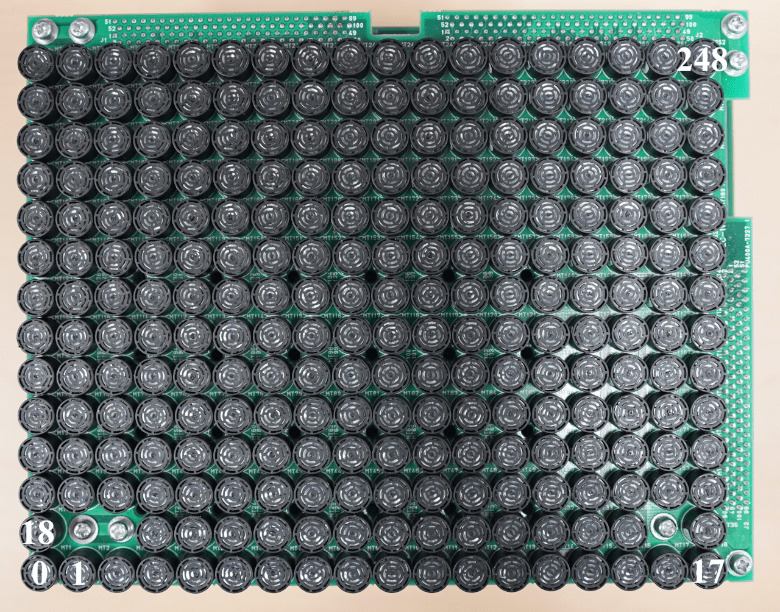

# Hardware

## AUTD3 Device

The AUTD3 device consists of 249 transducers per unit[^fn_asm].
Furthermore, multiple devices can be connected and expanded via daisy-chain.
From the SDK, the phase/intensity of all these transducers can be individually specified.

<figure>
  
  <figcaption>Surface photo of AUTD</figcaption>
</figure>

<figure>
  
  <figcaption>Back photo of AUTD</figcaption>
</figure>

The coordinate system of AUTD3 adopts the right-handed coordinate system, with the center of the 0-th transducer as the origin.
The x-axis is in the long axis direction, i.e., the direction from 0 to 17, and the y-axis is in the direction from 0 to 18.

Also, the unit of distance is mm.
The transducers are arranged at intervals of $\SI{10.16}{mm}$, and the size including the board is $\SI{192}{mm}\times\SI{151.4}{mm}$.

## Setup

Connect the PC and "EtherCAT In" of the first device with an ethernet cable (CAT 5e or higher), and connect "EtherCAT Out" of the $i$-th device to "EtherCAT In" of the $(i+1)$-th device.

The power supply for AUTD3 uses a $\SI{24}{V}$ DC.
The power supply can be connected mutually, and any of the three power connectors can be used.
The power connector on the AUTD3 device side uses Molex 5566-02A.

> NOTE: AUTD3 consumes a maximum of $\SI{2}{A}$ per device. Pay attention to the maximum output current of the power supply.

## Dimension Diagram

<figure>
  
  <figcaption>Dimensions diagram of the AUTD3 device</figcaption>
</figure>

[^fn_asm]: Out of $18\times 14=252$, 3 transducers are removed for screws. The reason for placing the screw holes in this position is to minimize the gap when multiple units are lined up.
