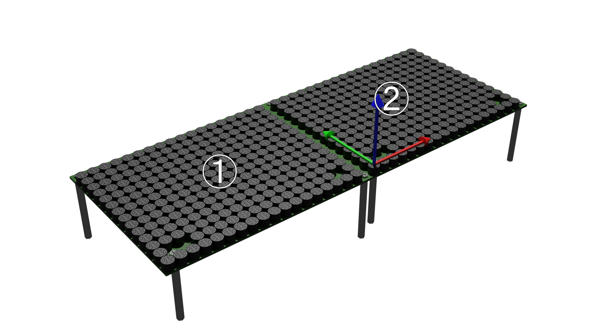

# Multiple Devices

AUTD3 can connect multiple devices in a daisy-chain to form a large array.
The SDK is designed to be used transparently even when multiple devices are connected.

When using multiple devices with the SDK, specify the `AUTD3` structure for each connected device in order in the first argument of the `Controller::open` function.
Refer to [Getting Started/Hardware](../getting_started/hardware.md) for hardware connection methods.

Below are the steps for connecting two devices.

[[_TOC_]]

## Translation Only

<figure>
  
</figure>

For example, if the devices are arranged and connected as shown above, with the device on the left being the first and the device on the right being the second, and the global coordinates are taken to be the same as the local coordinates of the first device, the code is as follows.

<div class="tabs">
<input id="rust_tab_trans" type="radio" class="tab" name="tab_trans" checked>
<label class="tab_item" n=4 for="rust_tab_trans">Rust</label>
<input id="cpp_tab_trans" type="radio" class="tab" name="tab_trans">
<label class="tab_item" n=4 for="cpp_tab_trans">C++</label>
<input id="cs_tab_trans" type="radio" class="tab" name="tab_trans">
<label class="tab_item" n=4 for="cs_tab_trans">C#</label>
<input id="python_tab_trans" type="radio" class="tab" name="tab_trans">
<label class="tab_item" n=4 for="python_tab_trans">Python</label>

```rust,edition2024
{{#include ../../../codes/Users_Manual/Tutorial/multiple/geometry_0.rs}}
```

```cpp
{{#include ../../../codes/Users_Manual/Tutorial/multiple/geometry_0.cpp}}
```

```cs
{{#include ../../../codes/Users_Manual/Tutorial/multiple/geometry_0.cs}}
```

```python
{{#include ../../../codes/Users_Manual/Tutorial/multiple/geometry_0.py}}
```
</div>

Here, `pos` represents the position of the device in global coordinates.
Note that `AUTD3::DEVICE_WIDTH` is the width of the device (including the outer shape of the board).

## Setting Global Coordinates

The origin and orientation of the global coordinates used by the SDK can be freely set by the user.

<figure>
  
</figure>

For example, if the global coordinates are taken to be the same as the local coordinates of the second device, the code is as follows.

<div class="tabs">
<input id="rust_tab_global" type="radio" class="tab" name="tab_global" checked>
<label class="tab_item" n=4 for="rust_tab_global">Rust</label>
<input id="cpp_tab_global" type="radio" class="tab" name="tab_global">
<label class="tab_item" n=4 for="cpp_tab_global">C++</label>
<input id="cs_tab_global" type="radio" class="tab" name="tab_global">
<label class="tab_item" n=4 for="cs_tab_global">C#</label>
<input id="python_tab_global" type="radio" class="tab" name="tab_global">
<label class="tab_item" n=4 for="python_tab_global">Python</label>

```rust,edition2024
{{#include ../../../codes/Users_Manual/Tutorial/multiple/geometry_1.rs}}
```

```cpp
{{#include ../../../codes/Users_Manual/Tutorial/multiple/geometry_1.cpp}}
```

```cs
{{#include ../../../codes/Users_Manual/Tutorial/multiple/geometry_1.cs}}
```

```python
{{#include ../../../codes/Users_Manual/Tutorial/multiple/geometry_1.py}}
```
</div>

## Translation and Rotation

To specify the rotation of the device, use `rot`.
Rotation can be specified using Euler angles or quaternions.

<figure>
  
</figure>

For example, if the devices are arranged as shown above, with the bottom being the first device and the left being the second device, and the global coordinates are taken to be the same as the local coordinates of the first device, the code is as follows.

<div class="tabs">
<input id="rust_tab_rot" type="radio" class="tab" name="tab_rot" checked>
<label class="tab_item" n=4 for="rust_tab_rot">Rust</label>
<input id="cpp_tab_rot" type="radio" class="tab" name="tab_rot">
<label class="tab_item" n=4 for="cpp_tab_rot">C++</label>
<input id="cs_tab_rot" type="radio" class="tab" name="tab_rot">
<label class="tab_item" n=4 for="cs_tab_rot">C#</label>
<input id="python_tab_rot" type="radio" class="tab" name="tab_rot">
<label class="tab_item" n=4 for="python_tab_rot">Python</label>

```rust,edition2024
{{#include ../../../codes/Users_Manual/Tutorial/multiple/geometry_2.rs}}
```

```cpp
{{#include ../../../codes/Users_Manual/Tutorial/multiple/geometry_2.cpp}}
```

```cs
{{#include ../../../codes/Users_Manual/Tutorial/multiple/geometry_2.cs}}
```

```python
{{#include ../../../codes/Users_Manual/Tutorial/multiple/geometry_2.py}}
```
</div>

> NOTE: Only the Rust version supports all 12 types of Euler angles.
> Other languages support only XYZ and ZYZ.
