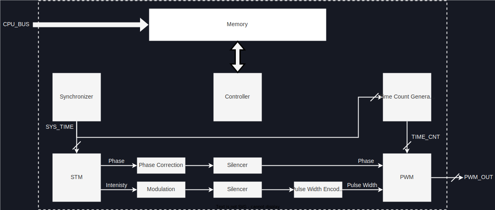

# 概要

FPGAにおける信号生成の流れを以下に示す.
なお, あくまで概念図なので実際の実装とは都合により異なる.

<figure>
  
  <figcaption>FPGA内部の概要図</figcaption>
</figure>

まず, CPUから送られてきたデータはすべて`Memory`モジュール内のBlock RAM (BRAM) に格納される.
`STM`モジュールは一定のサンプリングレート ($=\ufreq$) で振幅/位相データをBRAMからサンプリングする.
その後, 振幅データは`Modulation`モジュール内で変調データと掛け合わされる.
続けて, 振幅データは`Silencer`モジュールにより静音化処理 (急峻な変化を抑える処理) が施され, `Pulse Width Encoder`モジュールでパルス幅に変換され, 最後に`PWM`モジュールに渡される.
ただし, `Silencer`と`Pulse Width Encoder`の適用順序は入れ替えることができる.
位相データは`Silencer`モジュールに渡された後, `PWM`モジュールに渡される.
最後にパルス幅/位相データからPulse Width Modulation (PWM) 波形の出力が計算される.

以下に, 各モジュールの解説をしていく.
なお, 説明の都合上, 信号の流れる順とは異なる順序で説明する.
