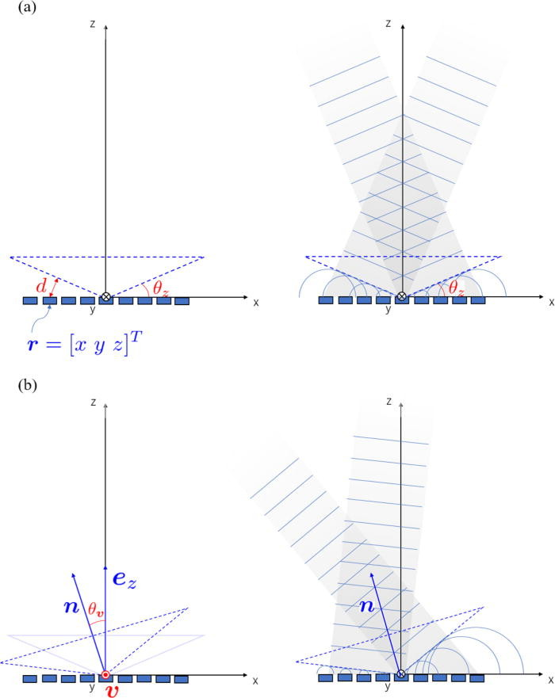

# Bessel
[Source](https://github.com/shinolab/autd3-rs/blob/v36.0.2/autd3/src/datagram/gain/bessel.rs)

`Bessel`ではBessel beamを生成する.
この`Gain`は長谷川らの論文[^hasegawa2017]に基づく.

{{ #tabs }}
{{ #tab name=Rust }}
```rust
{{#include ../../../../codes/Users_Manual/gain/bessel_0.rs}}
```
{{ #endtab }}
{{ #tab name=C++ }}
```cpp
{{#include ../../../../codes/Users_Manual/gain/bessel_0.cpp}}
```
{{ #endtab }}
{{ #tab name=C# }}
```cs
{{#include ../../../../codes/Users_Manual/gain/bessel_0.cs}}
```
{{ #endtab }}
{{ #tab name=Python }}
```python
{{#include ../../../../codes/Users_Manual/gain/bessel_0.py}}
```
{{ #endtab }}
{{ #endtabs }}

ここで, `pos`はビームを生成する仮想円錐 (下図の点線) の頂点であり, `dir`はビームの方向, `theta`はビームに垂直な面とビームを生成する仮想円錐の側面となす角度である (下図の$\theta_z$).

<figure>
  
  <figcaption>Bessel beam (長谷川らの論文より引用)</figcaption>
</figure>

オプションにて, 出力振幅と位相オフセットを指定できる.
デフォルト値は上記の通り.

[^hasegawa2017]: Hasegawa, Keisuke, et al. "Electronically steerable ultrasound-driven long narrow air stream." Applied Physics Letters 111.6 (2017): 064104.
