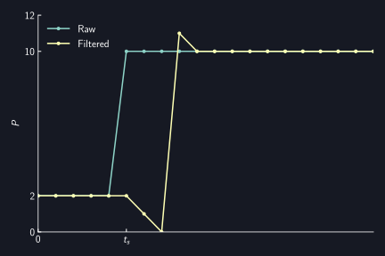

# Silencer

AUTD3には出力を静音化するためのSilencerが用意されている.
Silencerは, 振動子の駆動信号の急激な変動を抑制し, 静音化する.

[[_TOC_]]

## 理論

詳細は鈴木らの論文[^suzuki2020]を参照されたい.

大まかに概要を述べると, 

* 振幅変調された超音波は可聴音を生じる
* 超音波振動子を駆動する際に, 位相変化が振幅変動を引き起こす
    * したがって, 可聴音の騒音が生じる
* 位相変化を線形に補間し, 段階的に変化させることで振幅変動を抑えられる
    * したがって, 騒音を低減できる
* 補間を細かくやると, その分だけ騒音を小さくできる

となる.

## Silencerの設定

Silencerの設定には`Silencer`を送信する.

Silencerはデフォルトで適当な値に設定されている.
Silencerを無効化する場合は, `disable`を送信する.

{{ #tabs }}
{{ #tab name=Rust }}
```rust,edition2024
{{#include ../../../codes/Users_Manual/silencer/silencer_0.rs}}
```
{{ #endtab }}
{{ #tab name=C++ }}
```cpp
{{#include ../../../codes/Users_Manual/silencer/silencer_0.cpp}}
```
{{ #endtab }}
{{ #tab name=C# }}
```cs
{{#include ../../../codes/Users_Manual/silencer/silencer_0.cs}}
```
{{ #endtab }}
{{ #tab name=Python }}
```python
{{#include ../../../codes/Users_Manual/silencer/silencer_0.py}}
```
{{ #endtab }}
{{ #endtabs }}

より細く設定する場合は, 以下2つのモードから選択する必要がある.

- [位相/振幅変化速度がすべての振動子で同一のモード (Fixed update rate mode)](#fixed-update-rate-mode)
- [位相/振幅変化が完了するまで時間がすべての振動子で同一のモード (Fixed completion time mode)](#fixed-completion-time-mode)

なお, デフォルトではFixed completion time modeに設定されている.

### Fixed update rate mode

#### Fixed update rate modeにおける位相の変化

Silencerは位相$P$の変化を線形補間し, 段階的にすることで静音化を行う.
即ち, 位相$P$の時系列データを(単純)移動平均フィルタに通しているのにほとんど等しい.
ただし, 位相データが周期的であるという事を考慮している点で異なる.

例えば, 超音波の周期$T$が$T=12$の場合を考える. 即ち, $P=0$が$0\,\mathrm{rad}$, $P=12$が$2\pi\,\mathrm{rad}$に対応する. 
ここで, 時刻$t_s$で, 位相が$P=2$から$P=6$に変化したとする.
この時, Silencerによる位相変化は以下の図のようになる.

<figure>
  
<figcaption>位相$P$の変化</figcaption>
</figure>

一方, 時刻$t_s$で, 位相が$P=2$から$P=10$に変化したとする.
この時のSilencerによる位相変化は以下の図のようになる.
これは, $P=10$よりも, $P=-2$のほうが近いためである.

<figure>
  
<figcaption>位相$P$の変化 (位相変化量が$\pi$より大きい場合)</figcaption>
</figure>

つまり, Silencerは現在の$P$と目標値$P_r$に対して
$$
    P \leftarrow \begin{cases}
        P + \mathrm{sign}(P_r - P) \min (|P_r - P|, \Delta) & \text{if } |P_r - P| \le T/2\\
        P - \mathrm{sign}(P_r - P) \min (|P_r - P|, \Delta) & \text{(otherwise)}\\
    \end{cases},
$$
として位相$P$を更新する.
ここで, $\Delta$は1ステップ当たりの更新量 (`Silencer`の`step`) を表す.
なお, 更新周波数は$\ufreq$となっている.

$\Delta$が小さいほど, 位相変化はなだらかになり騒音が抑制される.

<figure>
  
<figcaption>$\Delta$による変化の違い</figcaption>
</figure>

この実装の都合上, 移動平均フィルタとは異なる挙動を示す場合がある.
一つは, 上に示した位相変化量が$\pi$より大きい場合であり, もう一つが, 途中でもう一度位相が変化する場合である.
この時の位相変化の例を以下に示す.
元時系列に対する忠実度という観点では移動平均フィルタが正しいが, 位相変化量が$\pi$より大きい場合を考慮したり, $\Delta$を可変にする (即ち, フィルタ長を可変にする) のが大変なため現在のような実装となっている.

<figure>
  
<figcaption>移動平均フィルタとの比較</figcaption>
</figure>

#### Fixed update rate modeにおける振幅の変化

振幅変動が騒音を引き起こすので, 振幅パラメータ$D$も同等のフィルタをかけることでAMによる騒音を抑制できる.

振幅パラメータ$D$は位相とは異なり周期的ではないので, 現在の$D$と目標値$D_r$に対して
$$
    D \leftarrow D + \mathrm{sign}(D_r - D) \min (|D_r - D|, \Delta),
$$
のように更新する.

#### Fixed update rate modeの設定

Fixed update rate modeを設定するには, 以下のようにする.
引数はそれぞれ, 上述の$\Delta$に対応する (単位は$2\pi/65536$).

{{ #tabs }}
{{ #tab name=Rust }}
```rust,edition2024
{{#include ../../../codes/Users_Manual/silencer/silencer_fixed_update_rate.rs}}
```
{{ #endtab }}
{{ #tab name=C++ }}
```cpp
{{#include ../../../codes/Users_Manual/silencer/silencer_fixed_update_rate.cpp}}
```
{{ #endtab }}
{{ #tab name=C# }}
```cs
{{#include ../../../codes/Users_Manual/silencer/silencer_fixed_update_rate.cs}}
```
{{ #endtab }}
{{ #tab name=Python }}
```python
{{#include ../../../codes/Users_Manual/silencer/silencer_fixed_update_rate.py}}
```
{{ #endtab }}
{{ #endtabs }}

### Fixed completion time mode

このモードでは, 位相/振幅変化が一定の時間で完了するようになる.

#### Fixed completion time modeの設定

Fixed completion time modeを設定するには, 以下のようにする.

`intensity`, `phase`はそれぞれ, 振幅/位相変化の完了まで時間に対応する.
これらは超音波周期 ($\SI{25}{us}$) の整数倍である必要がある.

{{ #tabs }}
{{ #tab name=Rust }}
```rust,edition2024
{{#include ../../../codes/Users_Manual/silencer/silencer_fixed_completion_steps.rs}}
```
{{ #endtab }}
{{ #tab name=C++ }}
```cpp
{{#include ../../../codes/Users_Manual/silencer/silencer_fixed_completion_steps.cpp}}
```
{{ #endtab }}
{{ #tab name=C# }}
```cs
{{#include ../../../codes/Users_Manual/silencer/silencer_fixed_completion_steps.cs}}
```
{{ #endtab }}
{{ #tab name=Python }}
```python
{{#include ../../../codes/Users_Manual/silencer/silencer_fixed_completion_steps.py}}
```
{{ #endtab }}
{{ #endtabs }}

デフォルト値は, 位相変化が$\SI{1}{ms}$, 振幅変化が$\SI{0.25}{ms}$である.
なお, Silencerの無効化は, 位相/振幅変化が超音波周期 ($\SI{25}{us}$) で終わることと等価である.

なお, このモードでは, `Modulation`や`FociSTM`, `GainSTM`の位相/振幅がSilencerに指定した時間で完了できない場合にエラーが返される.
すなわち, 以下の条件が満たされる必要がある.
- Silencerの振幅変化完了時間 $\le$ `Modulation`のサンプリング周期
- Silencerの振幅変化完了時間 $\le$ `FociSTM`/`GainSTM`のサンプリング周期
- Silencerの位相変化完了時間 $\le$ `FociSTM`/`GainSTM`のサンプリング周期

`strict_mode`を`false`にすれば, この条件を満たさない場合でもエラーを返さないようになるが, 推奨はされない.

[^suzuki2020]: Suzuki, Shun, et al. "Reducing amplitude fluctuation by gradual phase shift in midair ultrasound haptics." IEEE transactions on haptics 13.1 (2020): 87-93.
