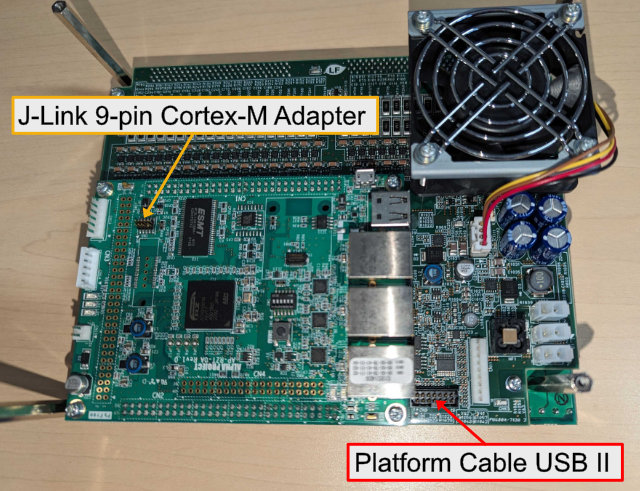

# ファームウェア

ファームウェアのアップデートには[Vivado](https://www.xilinx.com/products/design-tools/vivado.html), 及び, [J-Link Software](https://www.segger.com/downloads/jlink/)をインストールしたWindows 10/11 64bit PCが必要である.
なお, Vivado 2025.1, 及び, J-Link Software v8.10での動作を確認している.

> NOTE: ファームウェアのアップデートだけが目的であれば, "**Vivado Lab Edition**"の使用を強く推奨する. 
> ML Edition はインストールに60 GB以上のディスク容量を要求する. Lab Edition は6 GB程度のディスク容量で済む. 

> NOTE: 古いJ-Linkデバイスを使用する場合, "**Install legacy USB Driver for J-Link (requires admin rights)**"にチェックを入れること.
> 例えば, J-Link Plusの場合, V10以前はlegacy USB Driverが必要になる. (バージョンはJ-Link Plusデバイスの背面に書かれている.)
> 詳しくは[Segger Wiki](https://wiki.segger.com/J-Link_Model_Overview)を参照されたい. 使用しているデバイスにWinUSB featureがあれば, legacy USB Driverは不要.

まず, AUTD3デバイスとPCを[XILINX Platform Cable](https://www.xilinx.com/products/boards-and-kits/hw-usb-ii-g.html), 及び, [J-Link 9-Pin Cortex-M Adapter](https://www.segger-pocjapan.com/j-link-9-pin-cortex-m-adapter)付きの[J-Link Plus](https://www.segger.com/products/debug-probes/j-link/models/j-link-plus/)で接続し, AUTD3の電源を入れる.
次に, [autd3-firmware](https://github.com/shinolab/autd3-firmware)内の`autd_firmware_writer.ps1`をpowershellから実行し, 指示に従えばよい. updateには数分の時間を要する.

```shell
git clone https://github.com/shinolab/autd3-firmware
cd autd3-firmware
pwsh autd_firmware_writer.ps1
```

<figure>
    
    <figcaption>ファームウェアアップデート用ケーブル接続先</figcaption>
</figure>
